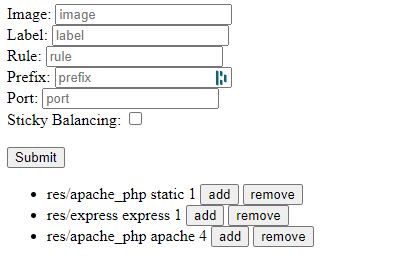

# Additional steps: Management UI

We didn't want to use a existant application, because we want to learn new things. We know that our apps is not perfect,
but it works for our situation.

## Installation
```bash
yarn install
#start the app
node index.js #start app on port 3000
```

We try to create a simple application with Express and dockerode.
The goal of this beautiful application (just kidding there is no CSS), is to create and control our docker
and traefik load balancing and reverse proxy.


## Configuration
With our application, we can create a Docker Container profile with some parameters.
- Image 
  - The docker image that'll be used to create the container
- Label
  - The name of the container
- Rule
  - The traefik rule so that the proxy can redirect the needed requests to the container
- Prefix
  - Prefix to access the container server
- Port
  - Port where the container will run

## How to use



In the top part we can create a Docker container profile, you must add Image and Label to the configuration, the rest is
optional. 
When you create a profile it appears in the bottom part. In this part you can add or remove containers to
loadbalancing your application

## Backend
In the backend there is an api:
- ``[GET]/containers`` Container's list
- ``[GET]/containers/:id`` One particular container profile
- ``[GET]/containers/:id/start?scale=:nb`` Start the indicated number of containers indicated by scale and/or suppress containers if scale's value is inferior to the current size of the container profile
- ``[GET]/containers/:id/stop``  Stop all containers from one container profile
- ``[GET]/containers/:id/add``  Add one container from one container profile
- ``[GET]/containers/:id/remove``  Add remove one container from one container profile
- ``[POST]/containers`` Create a new container profile
## What to improve
- autodiscovery the traefik containers with labels because if we quit the application all containers profiles are lost.
- CSS (because we're not in the 90's anymore)

## Issues that we know
The servers that we create don't have the same network than the traefik container. We tried to change the network with dockerode but we didn't success...
